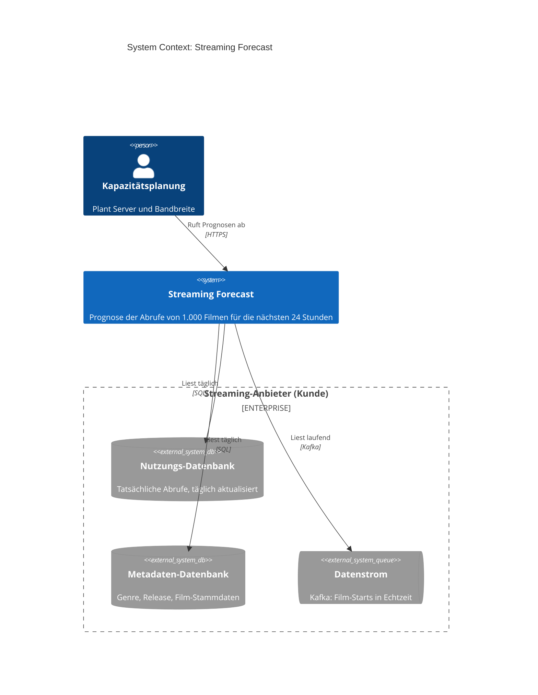
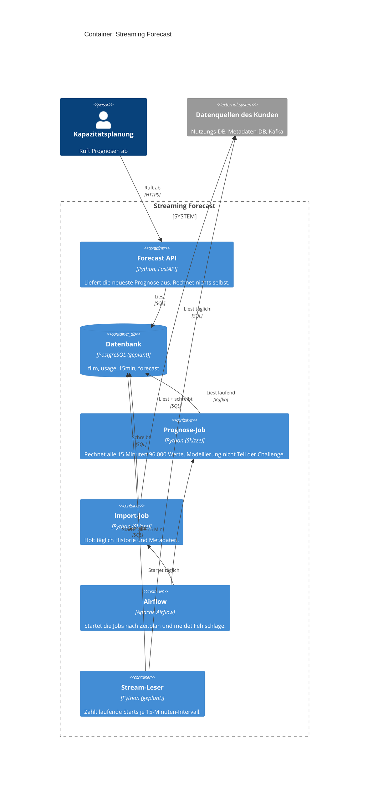
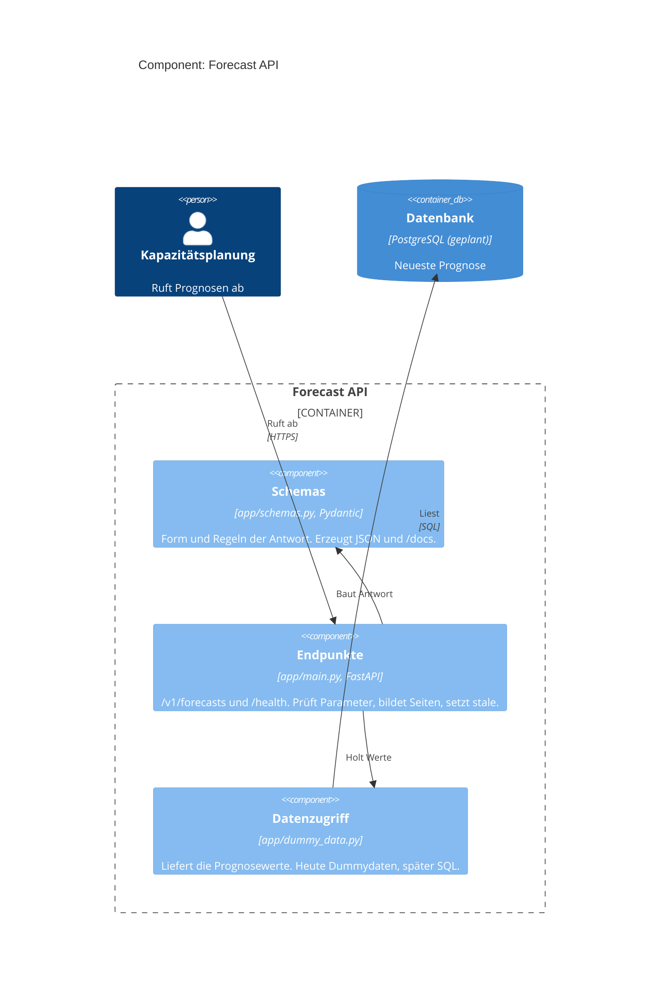
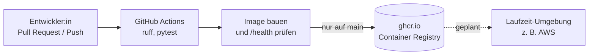

# Architektur (C4-Modell)

Drei Ebenen nach [c4model.com](https://c4model.com/), von grob nach fein:
**Context** (Wer nutzt das System?), **Container** (Welche laufenden Teile gibt es?),
**Component** (Wie ist die API aufgebaut?).

**Stand der Umsetzung:** Gebaut ist die API mit Dummydaten. Airflow-DAGs sind Skizzen
(nur `print`), die PostgreSQL-Datenbank gibt es noch nicht. Solche Teile sind im Text
mit *(geplant)* oder *(Skizze)* gekennzeichnet. Die Diagramme zeigen den Zielzustand.

## Notation

Farbe und Form sind nicht Dekoration, sondern tragen Bedeutung.

**Farbe = Zuständigkeit.** 
**Blauton = Ebene.** 

| Form | Bedeutung | Beispiel hier |
| --- | --- | --- |
| Rechteck mit rundem Kopf | Person | Kapazitätsplanung |
| Rechteck | System, Container oder Komponente | Forecast API |
| Zylinder | Datenspeicher | PostgreSQL, Nutzungs-Datenbank |
| Liegendes Rechteck mit Rundungen | Warteschlange oder Datenstrom | Kafka |
| Gestrichelter Rahmen | Grenze, kein eigenes Bauteil | „Streaming Forecast", „Streaming-Anbieter (Kunde)" |

## Ebene 1: System Context

Das System im Umfeld: Wer benutzt es, und von welchen fremden Systemen hängt es ab?

| Element | Bedeutung |
| --- | --- |
| Kapazitätsplanung | Hauptnutzer. Plant Serverkapazitäten und braucht dafür vor allem die Summe über alle Filme *(geplant)*. |
| Streaming Forecast | Unser System, das hier gebaut wird. |
| Nutzungs-Datenbank | Historie der tatsächlichen Abrufe. Wird einmal täglich aktualisiert, wir lesen nur. |
| Metadaten-Datenbank | Film-Stammdaten wie Genre und Release. Wir lesen nur. |
| Datenstrom | Kafka-Strom der Film-Starts. Schließt die Lücke zwischen zwei täglichen Importen. |

Die drei Quellen gehören dem Kunden. Der gestrichelte Rahmen fasst sie als fremde Organisation zusammen:
Wir lesen dort nur und können nichts daran ändern.

## Ebene 2: Container

Die Bausteine innerhalb des Systems. „Container“ meint hier einen eigenständig laufenden Teil
(Anwendung oder Datenspeicher), nicht zwingend einen Docker-Container.

| Container | Aufgabe | Wichtige Entscheidung |
| --- | --- | --- |
| Forecast API | Nimmt Anfragen an, liest die neueste Prognose, liefert JSON. Meldet über `stale`, wenn sie älter als 30 Minuten ist. | Die API **liest nur**. Dadurch ist sie schnell und liefert auch dann den letzten Stand, wenn der Job ausfällt. |
| Airflow | Startet Import und Prognose nach Zeitplan, wiederholt fehlgeschlagene Tasks und meldet Probleme. | Airflow **orchestriert nur**. Die Arbeit und alle Datenbankzugriffe erledigen die Jobs selbst. |
| Import-Job | `daily_import`: kopiert Historie und Metadaten (idempotent: Tag löschen, neu einfügen) und prüft die Datenqualität. | Idempotent, damit ein Retry nichts doppelt schreibt. |
| Stream-Leser | Liest den Kafka-Strom laufend und zählt die Starts je Film und 15-Minuten-Intervall in `usage_15min`. | Läuft **dauerhaft**, nicht nach Zeitplan, deshalb kein Airflow-Job. Schließt die Lücke zwischen zwei täglichen Importen. |
| Prognose-Job | Liest die Features aus `usage_15min` und schreibt 96 Intervalle × 1.000 Filme nach `forecast`. | **Blackbox:** Wie das Modell rechnet, ist laut Challenge nicht Teil der Aufgabe. Für die Architektur zählt nur, dass dieser Job die Tabelle `forecast` füllt. Der Lauf wird in **einer Transaktion** geschrieben. |
| Datenbank | Gemeinsamer Speicher. Jobs schreiben, die API liest. | Entkoppelt Rechnen und Ausliefern. Bis zur Einführung ersetzt `dummy_data.py` die Datenbank. |

### Datenfluss

1. **Laufend:** Der Stream-Leser zählt die Kafka-Ereignisse je Film und 15-Minuten-Intervall und schreibt sie nach `usage_15min`.
2. **Täglich 6:00 UTC:** Airflow startet den Import-Job. Er kopiert die Abrufe von gestern, korrigiert damit die gezählten Werte des Streams, kopiert die Metadaten und prüft, ob für jeden Film alle 96 Intervalle da sind.
3. **Alle 15 Minuten:** Airflow startet den Prognose-Job. Er baut die Features aus `usage_15min` und schreibt 96.000 Werte in die Tabelle `forecast` — in **einer Transaktion**, damit die API entweder den ganzen neuen oder noch den alten Lauf sieht.
4. **Bei jeder Anfrage:** Die API liest den Lauf mit dem größten `generated_at` und gibt ihn seitenweise aus.

Die Prognosen fließen **nicht durch Airflow hindurch**: Airflow startet den Job, und der Job schreibt
selbst in die Datenbank. Das ist bei Airflow wichtig, weil die Daten sonst über XCom liefen, was für
96.000 Werte der falsche Weg wäre.

### Was hier bewusst fehlt

Das Training des Modells und eine Modell-Registry (z. B. MLflow) sind **nicht eingezeichnet**. Die Challenge
nennt die Modellierung ausdrücklich nicht als Teil der Aufgabe. Der Prognose-Job bleibt trotzdem stehen,
weil ohne ihn niemand die Tabelle `forecast` füllt und die API keine Datenquelle hätte. Er ist eine
Blackbox: Dass er rechnet, ist relevant, wie er rechnet, nicht. `docs/KONZEPT.md` beschreibt den ML-Teil
als Ausblick.

## Ebene 3: Component (Forecast API)

Der Aufbau der API aus Dateien und Rollen.

| Komponente | Datei | Verantwortung |
| --- | --- | --- |
| Endpunkte | `app/main.py` | Eingabe prüfen (422 bei falschen Parametern, 404 bei unbekanntem Film), Seiten bilden, `stale` berechnen. |
| Schemas | `app/schemas.py` | Form und Regeln der Antwort, z. B. `predicted_streams >= 0`. |
| Datenzugriff | `app/dummy_data.py` | Einzige Stelle, die Daten liefert. Wird bei der Datenbank-Einführung ausgetauscht, ohne die Endpunkte zu ändern. |

## Ergänzung: Auslieferung (CI/CD)

Kein Teil der C4-Ebenen, aber für das Verständnis nützlich: Wie kommt der Code zum Image?

Bei jedem Pull Request laufen Linter und Tests, danach wird das Image gebaut und per `curl` auf
`/health` geprüft. Nur auf `main` wird das Image mit dem Commit-Hash als Tag hochgeladen.

